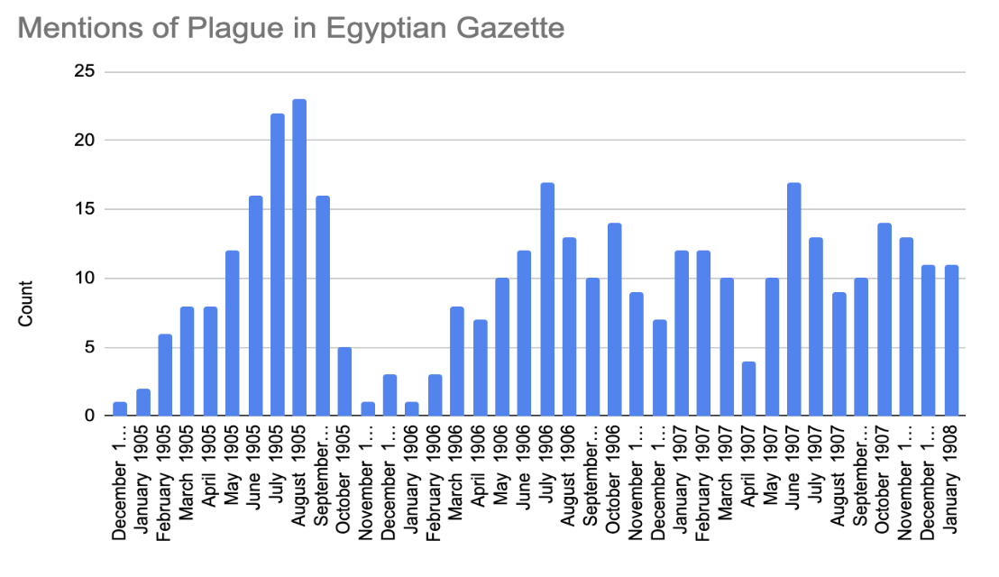
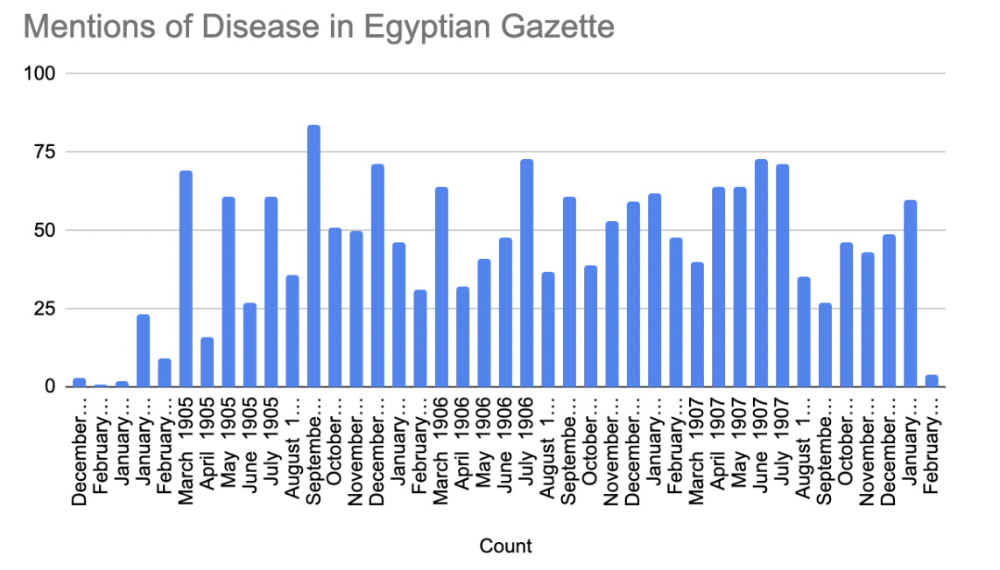
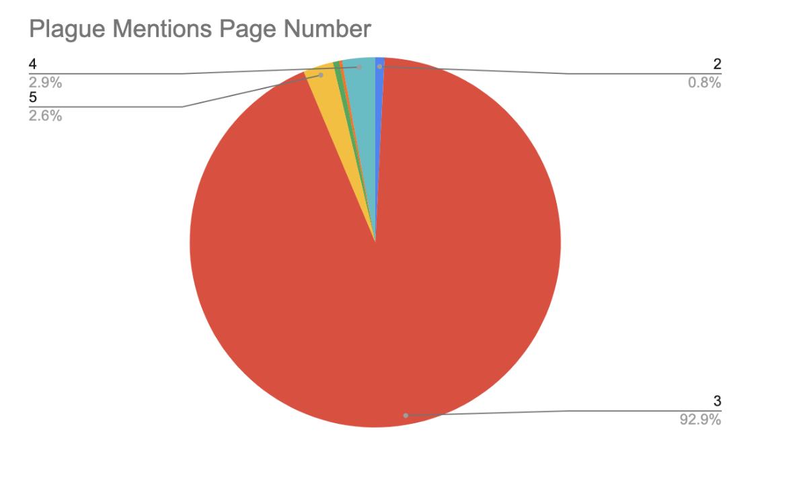
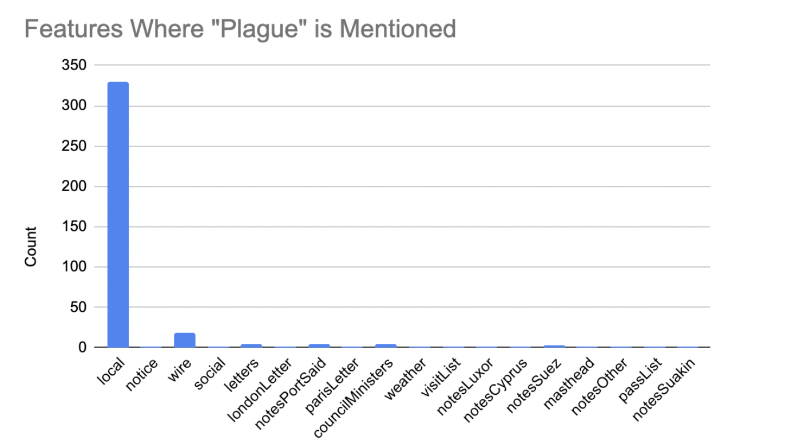
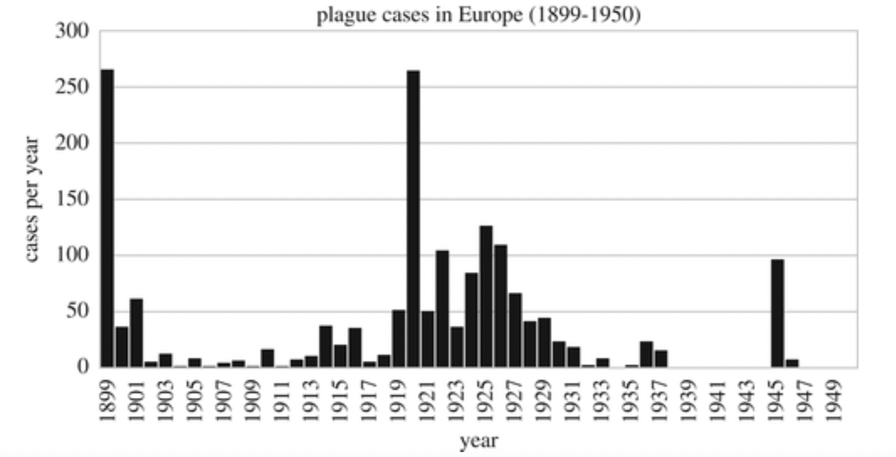
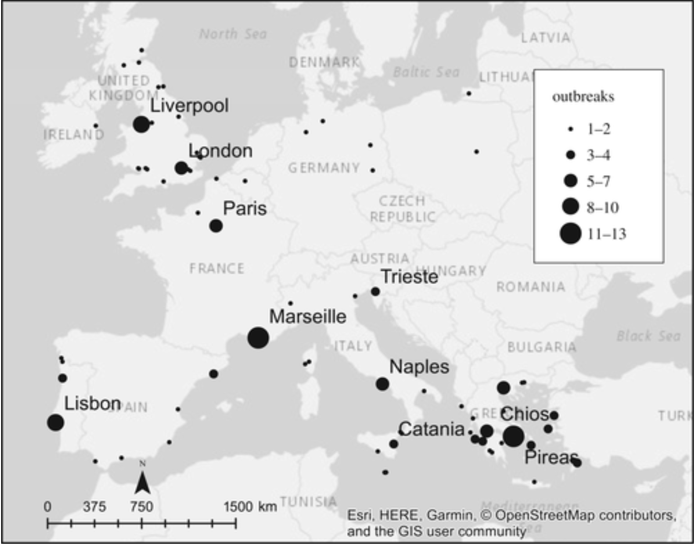

---
title: "Plague Mentions in the Egyptian Gazette"
authors: [GraceDamato]
date: 2022-11-30
categories: [analysis]
--- 

In preparing for my analysis project, I ran the XPath Query: 

`//div[matches(.,'plague', 'i')]/*[not(matches(.,'cattle'))]/*[not(matches(.,'locust'))]/head`

This specific XPath is designed to find how often headlines containing the word “plague" are found in the Egyptian Gazette. Not only that, but because I am looking for sapient incidents, the XPath excluded instances where cattle or locusts were mentioned in conjunction with “plague”. 
 

The XPath, along with the word search, produced results that revealed an annual spike in the Egyptian Gazette's mentions of the term plague along with repeated occurrences of the influx from 1905-1906. As illustrated in the chart below, the Egyptian Gazette contains headlines with the word "plague" almost twice as many times between early summer to early fall months compared to in the winter and spring. Curious to see if there were any correlations to explain this phenomenon, I conducted a simple word search through the content repository to find how many times disease” was mentioned in the newspaper. Because of the extensive use of this term, my query yielded significantly more results than when looking for plague headlines. However, the mentions of disease seemed to follow a similar pattern to those of the plague. While it is not as dramatic of a fluctuation, the subtle increase and decrease in the references to disease seem to correspond with the plague's annual influx. This phenomenon led me to wonder: Why are there significantly more occurrences of the word “plague” being mentioned in one part of the year than in the other?
 
Unfortunately, there are challenges with answering this question. For one, not a lot of information is given on the Plague in Egypt between 1905-1907, and most data on disease cases refer to European and American studies. Furthermore, a wide range of factors potentially explains why the Plague was talked about more during one half of the year than the other. Public perceptions, case numbers, weather, or even shipping movements could all contribute to the Egyptian Gazette's decision to increase or decrease their mentions of the Plague.
 
To fully understand the importance of these mentions in an Alexandrian newspaper, one must first understand the context of the term "plague." In the Egyptian Gazette, the term “plague” is often synonymous with “Bubonic Plague”. The bubonic plague is caused by a highly infectious bacterium called Yersinia Pestis. This disease, normally transmitted by fleas on rats, causes fever-like symptoms in victims that can escalate to swollen and painful lymph nodes and even death. Throughout history, there have been several instances when plague epidemics have erupted, most infamously being the Black Death in 1346–1353. 
 
That said, 92.9% of the mentions of the Plague were on page three of the Egyptian Gazette. I found this information by applying the XPath //div[matches(.,'disease', 'i')] to find the date, page, and section identifier for every occurrence of the word plague in the Egyptian Gazette. This abundance of mentions on page three is because 329 of the 380 mentions of the Plague (not just headlines), between January 1905 and January 1908, were found in the “Local and General” section of the newspaper. 

This is relevant because page three is typically the first page in the Egyptian gazette that does not primarily contain advertisements. Therefore, if a reader wanted non-advertised information, they would likely turn to page three first. Furthermore, the "Local and General" section of the Gazette is normally the first column on page three. Therefore, these contents are placed optimally to be most noticed and read by the newspaper's subscribers. Even more, plague information would have been highly relevant to the people of Alexandria due to the risk associated with diseases in major cities. 
 
A research article published by The Royal Society illustrates European case numbers of the plague during the early 20th century. Their findings support the idea of plague epidemics being pervasive in highly populated regions such as coastal or inland port cities. The data revealed Europe was recovering from a major outbreak of the Plague in 1899, in which 250 cases were recorded. However, this number dropped to less than 20 by 1903. Most of the cases were recorded in coastal and inland port cities such as London, Liverpool, and Marseille. Since Alexandria is also a major port city with heavy traffic between these sites, Egypt would likely have been concerned with outbreaks in its own cities, especially in the wake of a major European Pandemic. Furthermore, cities such as London and Liverpool are listed in the Egyptian Gazette as frequent areas of “special outside dispatches” under the Exterieur section of the Newspaper.
 

However, despite concerns over plague outbreaks, European case numbers were significantly low between 1902 and 1909. While there was a drastic case spike in 1899, the years that I am analyzing (1904-1907) reportedly witnessed a recession in case numbers. This statistic could imply that cases mentioned in the Egyptian Gazette would be more likely identified as anomalies than common occurrences. Furthermore, because Europe was recovering from a major outbreak only a few years prior, and Alexandria had close international ties with the European community, any cases in heavily populated areas would have been concerning to see. 
 
Additionally, in 30 separate instances, 10% of the plague headlined occurrences, "quarantine" was also mentioned. While quarantining was a heavily enforced precaution taken during this time, it had a controversial history. After a series of deadly plagues hit Alexandria in the early 1800s, increased quarantine regulations were set in place to prevent future spreads. However, this action faced significant opposition from merchants and Muslim Egyptians who felt their ways of life were being threatened. Merchants were worried about how the policies would affect trade, while Muslims were disturbed by the quarantine's violations against Islamic law. Not only that, but many Egyptians feared being removed from their homes and sent into isolation if they were found to have the Plague. Unfortunately, the region experienced several more epidemics throughout the mid-19th century, up until 1844. After that, the plague mysteriously disappeared for almost 55 years, likely a testament to the heavily enforced sanitary and quarantine standards which were implemented well into the 20th century. For example, an entry from September 1905 states:
 
>“Only one fresh case of plague occurred in Egypt throughout last week, namely at Alexandria, and all other places are declared free. Three Europeans recovered during this period and there were two deaths, and one fresh case, an Italian grocer in the Menshieh district was notified yesterday. There are now only two cases under treatment. The total number of cases from January 1 to date amounts to 258, as compared with 804 during the corresponding period of last year. In consequence of the notification of a fresh case at Alexandria, the quarantine measures against departures from this port have been re-established”.
 
The Plague’s highly contagious nature, along with its history in Europe and Alexandria, encouraged the implementation of isolation and quarantine practices. While the connection between the Plague and quarantine does not directly explain the reasons for increased mentions of the disease in the Egyptian Gazette, it does give insight into how the public perceived the Plague and the measures that were taken to combat it. Furthermore, despite conflicting attitudes on the practice throughout the 19th century, quarantining was, overall, believed to be an effective strategy in fighting outbreaks and would have reassured readers that necessary action was taking place to ensure their safety. 
 
Even more, amid the 19th-century pandemics, many European residents in Egypt believed that plague season had “easily defined limits” according to the _University of California Press E-Books Collection on 1982-2004_. But rather than expecting cases to increase in the summer months, as the Egyptian Gazette data would suggest, Egyptians witnessed a decline in plague cases starting in June. They even celebrated the plague's disappearance alongside "al-Nuqta", their annual summer celebration of the rise of the Nile River. Egyptians also participated in festivities on St. John’s Day (June 26) to acknowledge their escape from the Plague's last arrival. Some European travelers even noted that it was “well known that extreme heat checks the plague in the same manner as the cold season." This discovery seems to run contrary to the information on the plague found in the Egyptian Gazette. Even though mentions of the Plague are not indicative of actual case numbers, if heat and extreme temperatures deterred the disease, then it would be expected that mentions would decline during the hotter months. Instead, we see a rise in the number of mentions of the plague between May and September.
 
Overall, there are many potential reasons the word “plague” was talked about in different amounts throughout the years. For example, the fluctuation could be the result of conflicting attitudes toward quarantine practices, or it could be the product of preexisting outbreak fears that increased during the Summer and Fall months. Another explanation is that case numbers did actually increase during these months despite anecdotal and historical claims to the contrary. The data itself could also be flawed and not accurately reflect the Egyptian Gazette’s true contents.
 
In the end, many factors could have influenced the data reflected in my initial query, and there is no definitive way to isolate one, if any, as the true cause. Still, despite the inconclusiveness of my results, a greater picture of the plague in 19th-20th century Egypt and its impact on the public was revealed through this analysis. Each mention of the plague is the product of a long and complicated history of epidemics experienced by Egyptians and Europeans. These findings could inspire further research into how the Plague was portrayed in media at the time, such as in newspapers and journals, and how it has evolved over the next century as a result of scientific and intellectual advancements and shifted perceptions on acute diseases.
 
Sources:

[Digital Egyptian Gazette - _Bubonic Plague In Egypt_](https://dig-eg-gaz.github.io/post/2016-11-06-cyr-bubonic-plague/)

[Digital Egyptian Gazette - _Bubonic Plague In Egypt, 1905_](https://dig-eg-gaz.github.io/post/16-analysis-cyr/)

[The Royal Society Publishing - _The Third Plague Pandemic in Europe_](https://royalsocietypublishing.org/doi/10.1098/rspb.2018.2429)

[_University of California Press E-Books Collection on 1982-2004_](https://publishing.cdlib.org/ucpressebooks/view?docId=ft5t1nb3mq&chunk.id=d0e1179&toc.depth=1&toc.id=d0e1179&brand=ucpress)
 
 